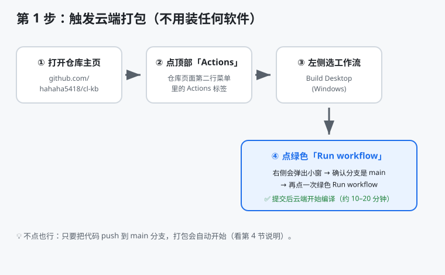
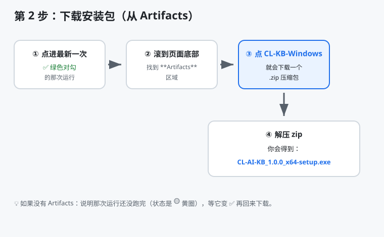
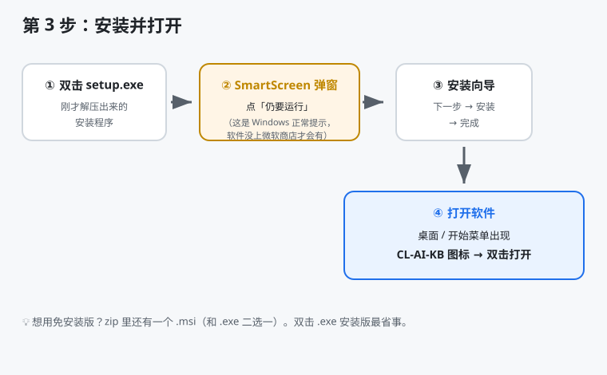

# 📦 CL 的 AI 知识库 —— 桌面版软件（超详细安装指南）

> 你的电脑**不用装任何编译环境**（不用装 Android Studio、不用装 Rust、不用装 Node）。
> 所有编译都在 **GitHub 云端电脑**上完成，你只需要在网页上**点几下、下载、双击安装**。
> 本指南写给**完全不懂技术**的你，照着序号点就行。

---

## 🖼️ 三步总览

| 步骤 | 你在哪操作 | 要干啥 | 大概耗时 |
|---|---|---|---|
| 第 1 步 | GitHub 网页 | 点一下「开始打包」 | 10–20 分钟（云端跑，你不用等） |
| 第 2 步 | GitHub 网页 | 下载安装包 | 1 分钟 |
| 第 3 步 | 你自己的电脑 | 双击安装 | 1 分钟 |

> 第 1 步是「让云端开始干活」，它跑的时候你该干嘛干嘛；
> 等它跑完（变 ✅）再来第 2、3 步。

---

## 🚀 第 1 步：触发云端打包



**方式 A（最省事，推荐）：等它自动跑**
> 你把代码 push 到 `main` 分支后，GitHub 会**自己开始打包**，你什么都不用点。
> 直接跳到第 2 步等结果即可。

**方式 B（手动点一下）：**
1. 打开仓库主页：`https://github.com/hahaha5418/cl-kb`
2. 页面**第二行菜单**里点 **`Actions`**（就在 Code / Issues / Pull requests 那一排）
3. 左侧列表里点 **`Build Desktop (Windows)`**
4. 右边会出现一个 **绿色的 `Run workflow` 按钮** → 点它
5. 弹出小窗口，确认分支是 **`main`** → 再点一次绿色 **`Run workflow`**
6. 页面出现一条新的运行记录，左边是个**黄圈 🟡**（表示正在跑）

⏳ 现在可以去喝杯水。**首次约 10–20 分钟**，第二次起因为有缓存会快很多。

---

## ⬇️ 第 2 步：下载安装包



1. 回到 **`Actions`** 页面，点进**最新那次 ✅ 绿色对勾**的运行
   - 如果还是 🟡 黄圈，说明还没跑完，等它变 ✅ 再来
2. 把页面**一路滚到最底部**，找到 **`Artifacts`** 这个区域
3. 点 **`CL-KB-Windows`** → 自动下载一个 `.zip` 压缩包
4. 下载完**双击解压**这个 zip，里面会得到：
   - 🟢 **`CL-AI-KB_1.0.0_x64-setup.exe`** ← **双击安装版（推荐，最省事）**
   - ⚪ `CL-AI-KB_1.0.0_x64_en-US.msi` ← 微软标准安装包（二选一，不用两个都装）

> 找不到 Artifacts？要么运行还没跑完（看第 1 步第 1 条），要么那次运行失败了（看页面里红色步骤的报错，把最后 20 行发给我）。

---

## 💿 第 3 步：安装并打开



1. **双击**解压出来的 `CL-AI-KB_1.0.0_x64-setup.exe`
2. 如果弹出 **SmartScreen 安全警告**（蓝/黄底，写着「Windows 已保护你的电脑」）：
   - 点左下角 **「仍要运行」**（或「更多信息」→「仍要运行」）
   - 这是 Windows 对「没上微软商店的软件」的**正常提示**，咱们的软件是安全的
3. 跟着安装向导点：**下一步 → 安装 → 完成**（基本一路下一步就行）
4. 安装好后，**桌面**或**开始菜单**会出现一个 **`CL-AI-KB`** 图标 → **双击打开**

🎉 恭喜，这就是你**第一个真正属于自己的 AI 知识库软件**，纯本地运行！

> 软件内的 AI 助手、联网查最新热点等功能**联网时才用网络**；
> 已离线缓存的内容不联网也能看。

---

## 🔁 哪些文件改动会自动触发打包？（给以后留档）

> 下面的文件只要被 push 到 `main`，**打包就会自动重新跑一次**（出新安装包）。
> 其他文件改动（比如只改了某篇教程文字）**不会**触发打包，只是更新网站内容。

| 文件 / 目录 | 作用 | 改动后是否触发打包 |
|---|---|---|
| `.github/workflows/build-desktop.yml` | 打包工作流本身 | ✅ 会（改了打包规则） |
| `src-tauri/**` | 桌面程序壳（窗口/图标/入口） | ✅ 会 |
| `docs/**` | 知识库全部内容（教程/热点/术语） | ✅ 会（内容更新进软件） |
| `tools/**` | 内容构建脚本 | ✅ 会 |
| `package.json` | 前端依赖与脚本 | ✅ 会 |
| `scripts/**`（除上面外） | AI 抓取/生成脚本 | ❌ 不会（仅影响站点，不影响打包触发） |
| `DESKTOP.md`、`desktop-guide-assets/**` | 本安装指南与配图 | ❌ 不会 |

> 简单记：**动到 `docs/` 或 `src-tauri/`，就等于「让软件内容升级并重打一个新安装包」**。

---

## ❓ 常见问题

**Q：打包失败了怎么办？**
打开 `Actions` → 点进失败的那次 → 看**红色步骤**的报错日志，把最后 20 行发我，我来定位修。

**Q：首次好慢 / 卡住？**
云端首次要下载 Rust 工具链 + NSIS 安装器，偶尔网络抖动会慢。在失败运行右上角点 **`Re-run all jobs`** 重试即可。

**Q：想装到手机（安卓 APK）？**
本方案是备选项（用 Capacitor 打包网页成 APK）。桌面版成本更低、体积更小，先把它用顺手；真需要手机版再说一声，我再加一条 APK 流水线。

**Q：每天热点更新后，已装的软件会自动变新吗？**
不会自动更新已装软件。但联网模式下软件里的热点仍是**最新**的；想更新离线版，等下次 push 触发打包后重新下载安装即可。

---

## 🧱 文件结构（给以后留档）

```
cl-kb/
├── src-tauri/                    # 桌面程序壳（Rust）
│   ├── tauri.conf.json           # 窗口标题/大小、打包目标、图标
│   ├── Cargo.toml                # 依赖（只有 tauri 一项核心）
│   ├── build.rs / src/main.rs    # 构建脚本 / 程序入口（约 10 行）
│   └── icons/                    # 桌面图标
├── .github/workflows/
│   └── build-desktop.yml         # 云端打包工作流（push main / 手动触发）
├── desktop-guide-assets/         # 本指南的 3 张步骤示意图（SVG）
└── DESKTOP.md                    # 你正在看的这份指南
```
